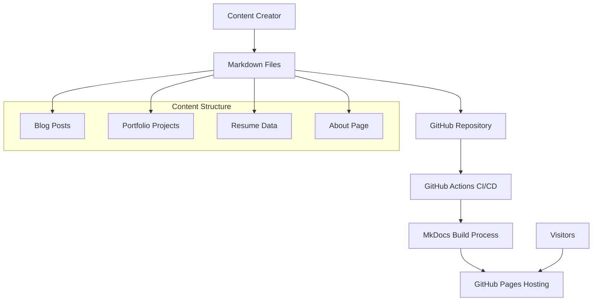

# Design Document

## Overview

The personal portfolio website enhancement builds upon the existing Material for MkDocs foundation to create a comprehensive professional presence. The design leverages MkDocs' blog plugin, Material theme capabilities, and GitHub Pages hosting to deliver a modern, responsive portfolio site with automated content management.

The architecture maintains the current setup while adding structured portfolio and resume sections, enhanced navigation, and improved content organization. The design emphasizes simplicity, performance, and maintainability while showcasing professional expertise through blog content and portfolio projects.

## Architecture

### High-Level Architecture



### Technology Stack

- **Static Site Generator**: MkDocs with Material theme
- **Content Format**: Markdown with YAML frontmatter
- **Styling**: Material theme with custom CSS overrides
- **Hosting**: GitHub Pages
- **CI/CD**: GitHub Actions
- **Search**: Built-in MkDocs search plugin
- **Blog Management**: MkDocs blog plugin

## Components and Interfaces

### Navigation Structure

The site navigation will be enhanced to include all portfolio sections:

```yaml
nav:
  - Home: index.md
  - About: about.md
  - Resume: resume.md
  - Portfolio: portfolio.md
  - Blog: blog/index.md
```

### Content Components

#### 1. Home Page Component
- Hero section with professional introduction
- Featured blog posts grid
- Quick links to key sections
- Social media links

#### 2. Blog Component
- Automated post listing via blog plugin
- Category/tag filtering
- Search functionality
- Post metadata (date, read time, categories)
- Syntax highlighting for code blocks

#### 3. Portfolio Component
- Project showcase grid
- Project detail pages
- Technology tags
- Links to live demos and repositories
- Visual assets (screenshots, diagrams)

#### 4. Resume Component
- Structured professional experience
- Skills matrix
- Education section
- Downloadable PDF option
- Contact information

#### 5. About Component
- Personal narrative
- Professional background
- Current role and interests
- Professional photo

### File Structure

```
docs/
├── index.md                 # Home page
├── about.md                 # About page
├── resume.md                # Resume page
├── portfolio.md             # Portfolio landing page
├── portfolio/               # Portfolio project pages
│   ├── project-1.md
│   ├── project-2.md
│   └── ...
├── blog/                    # Blog content
│   ├── index.md
│   ├── .authors.yml
│   └── posts/
│       ├── post-1.md
│       └── ...
├── assets/                  # Static assets
│   ├── images/
│   ├── js/
│   └── favicon.svg
└── stylesheets/
    └── custom.css
```

## Data Models

### Blog Post Model

```yaml
---
title: "Post Title"
description: "Post description"
date: 2024-01-15
categories:
  - AWS
  - Kubernetes
tags:
  - devops
  - cloud
authors:
  - alan
draft: false
---
```

### Portfolio Project Model

```yaml
---
title: "Project Name"
description: "Project description"
technologies:
  - Python
  - AWS
  - Kubernetes
status: "Completed"
demo_url: "https://demo.example.com"
repo_url: "https://github.com/user/repo"
featured_image: "assets/images/project-screenshot.png"
date_completed: 2024-01-15
---
```

### Resume Data Structure

```yaml
# In resume.md frontmatter
---
title: "Resume"
contact:
  email: "alan@example.com"
  linkedin: "https://linkedin.com/in/alanliangdev"
  github: "https://github.com/alanliangdev"
skills:
  - category: "Cloud Platforms"
    items: ["AWS", "Azure", "GCP"]
  - category: "Container Orchestration"
    items: ["Kubernetes", "Docker", "ECS"]
experience:
  - title: "Staff Platform Engineer"
    company: "Commonwealth Bank of Australia"
    duration: "2020 - Present"
    achievements:
      - "Led enterprise-scale migration to AWS"
      - "Built self-service Kubernetes platform"
---
```

## Error Handling

### Build-Time Error Handling

1. **Invalid Markdown**: MkDocs will fail the build with clear error messages
2. **Missing Assets**: Asset references will be validated during build
3. **Configuration Errors**: YAML syntax errors will prevent deployment
4. **Plugin Errors**: Blog plugin issues will halt the build process

### Runtime Error Handling

1. **404 Pages**: Custom 404.md template for missing pages
2. **Broken Links**: Link validation during build process
3. **Image Loading**: Fallback handling for missing images
4. **Search Failures**: Graceful degradation when search is unavailable

### GitHub Actions Error Handling

```yaml
# Error handling in workflow
- name: Build site
  run: mkdocs build --strict
  continue-on-error: false

- name: Deploy on success
  if: success()
  uses: peaceiris/actions-gh-pages@v3
```

## Testing Strategy

### Content Validation

1. **Markdown Linting**: Automated markdown syntax checking
2. **Link Validation**: Verify all internal and external links
3. **Image Optimization**: Ensure images are properly sized and optimized
4. **Accessibility Testing**: Validate WCAG compliance

### Build Testing

1. **Local Development**: `mkdocs serve` for local testing
2. **Build Validation**: `mkdocs build --strict` to catch errors
3. **Preview Deployments**: Test builds in GitHub Actions
4. **Cross-Browser Testing**: Manual testing across browsers

### Performance Testing

1. **Page Load Speed**: Lighthouse audits in CI/CD
2. **Mobile Responsiveness**: Automated responsive design testing
3. **SEO Validation**: Meta tags and structured data verification
4. **Search Functionality**: Verify search index generation

### Automated Testing Pipeline

```yaml
name: Test and Deploy
on: [push, pull_request]

jobs:
  test:
    runs-on: ubuntu-latest
    steps:
      - uses: actions/checkout@v3
      - name: Setup Python
        uses: actions/setup-python@v4
        with:
          python-version: '3.x'
      - name: Install dependencies
        run: pip install mkdocs-material
      - name: Test build
        run: mkdocs build --strict
      - name: Run link checker
        run: # Link validation command
      - name: Lighthouse audit
        run: # Performance testing
```

### Content Management Workflow

1. **Draft Posts**: Use `draft: true` in frontmatter for unpublished content
2. **Content Review**: Pull request workflow for content changes
3. **Automated Deployment**: Merge to main triggers deployment
4. **Rollback Strategy**: Git-based rollback for problematic deployments

## Integration Points

### GitHub Integration

- **Repository**: Source code and content storage
- **Actions**: Automated build and deployment
- **Pages**: Static site hosting
- **Issues**: Content planning and bug tracking

### External Services

- **Font Awesome**: Icon library for social links and UI elements
- **Google Fonts**: Typography (Roboto family)
- **GitHub API**: Potential integration for dynamic repository data

### Analytics and Monitoring

- **GitHub Pages Analytics**: Basic traffic monitoring
- **Search Console**: SEO monitoring and optimization
- **Lighthouse CI**: Performance monitoring in pipeline

## Security Considerations

### Content Security

1. **Input Sanitization**: Markdown content is processed safely by MkDocs
2. **Asset Validation**: Only trusted assets in repository
3. **External Links**: Proper `rel` attributes for external links

### Deployment Security

1. **GitHub Actions**: Secure token handling for deployments
2. **Branch Protection**: Require reviews for main branch changes
3. **Dependency Management**: Regular updates of MkDocs and plugins

### Privacy Considerations

1. **No User Tracking**: Static site with minimal analytics
2. **External Resources**: Minimize third-party resource loading
3. **Contact Information**: Professional contact only, no personal details