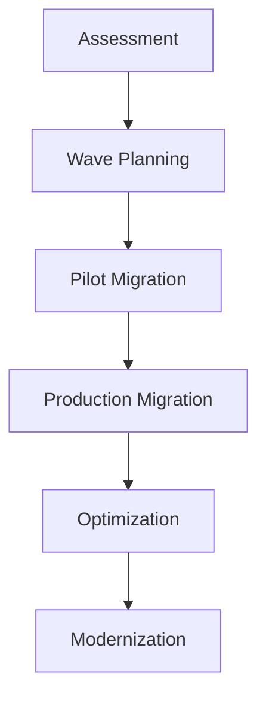

# Cloud Migration & Cost Optimization

## Project Overview

Led a comprehensive enterprise-scale migration from on-premises infrastructure to AWS, transforming the technology landscape for a major financial institution. The project involved migrating 500+ applications, 200TB of data, and establishing cloud-native operations while achieving significant cost savings and performance improvements.

## Key Achievements

- **Cost Reduction**: 40% reduction in total infrastructure costs ($8.2M annual savings)
- **Performance**: 60% improvement in application response times
- **Scalability**: Elastic infrastructure supporting 10x traffic spikes
- **Reliability**: Improved uptime from 99.5% to 99.95%

## Migration Strategy

### Assessment & Planning Phase

- **Application Portfolio Analysis**: Categorized 500+ applications using the 6 R's framework
- **Dependency Mapping**: Identified critical application dependencies and integration points
- **Risk Assessment**: Comprehensive risk analysis with mitigation strategies
- **Cost Modeling**: Detailed TCO analysis comparing on-premises vs. cloud costs

### Migration Approach



## Technical Architecture

### Landing Zone Design

Implemented AWS Control Tower with multi-account strategy:

- **Core Accounts**: Log Archive, Audit, Master
- **Environment Accounts**: Dev, Test, Staging, Production
- **Workload Accounts**: Application-specific isolated environments
- **Shared Services**: Centralized networking, DNS, and monitoring

### Network Architecture

```yaml
# Example CloudFormation for VPC setup
AWSTemplateFormatVersion: '2010-09-09'
Description: 'Enterprise VPC with multi-AZ setup'

Resources:
  VPC:
    Type: AWS::EC2::VPC
    Properties:
      CidrBlock: 10.0.0.0/16
      EnableDnsHostnames: true
      EnableDnsSupport: true
      
  PrivateSubnetA:
    Type: AWS::EC2::Subnet
    Properties:
      VpcId: !Ref VPC
      CidrBlock: 10.0.1.0/24
      AvailabilityZone: !Select [0, !GetAZs '']
      
  PrivateSubnetB:
    Type: AWS::EC2::Subnet
    Properties:
      VpcId: !Ref VPC
      CidrBlock: 10.0.2.0/24
      AvailabilityZone: !Select [1, !GetAZs '']
```

## Migration Waves

### Wave 1: Low-Risk Applications (3 months)
- **Scope**: 50 non-critical applications
- **Strategy**: Lift-and-shift with minimal changes
- **Results**: Established migration patterns and tooling

### Wave 2: Core Business Applications (12 months)
- **Scope**: 200 business-critical applications
- **Strategy**: Re-platform with cloud-native services
- **Results**: Significant performance improvements

### Wave 3: Legacy Modernization (9 months)
- **Scope**: 250 legacy applications
- **Strategy**: Re-architect and containerize
- **Results**: Maximum cost optimization and scalability

## Cost Optimization Strategies

### Right-Sizing & Resource Optimization

- **EC2 Instance Optimization**: Analyzed usage patterns and right-sized instances
- **Reserved Instance Strategy**: 3-year commitments for predictable workloads
- **Spot Instance Integration**: 70% cost reduction for batch processing workloads
- **Storage Optimization**: Intelligent tiering and lifecycle policies

### Automated Cost Management

```python
# Example cost optimization automation
import boto3
import json

def optimize_unused_resources():
    ec2 = boto3.client('ec2')
    
    # Find unused EBS volumes
    volumes = ec2.describe_volumes(
        Filters=[{'Name': 'status', 'Values': ['available']}]
    )
    
    unused_volumes = []
    for volume in volumes['Volumes']:
        if not volume.get('Attachments'):
            unused_volumes.append(volume['VolumeId'])
            
    return unused_volumes

def implement_lifecycle_policies():
    s3 = boto3.client('s3')
    
    lifecycle_config = {
        'Rules': [{
            'ID': 'cost-optimization',
            'Status': 'Enabled',
            'Transitions': [
                {
                    'Days': 30,
                    'StorageClass': 'STANDARD_IA'
                },
                {
                    'Days': 90,
                    'StorageClass': 'GLACIER'
                }
            ]
        }]
    }
    
    return lifecycle_config
```

## Security & Compliance

### Security Framework

- **Identity & Access Management**: Centralized IAM with least privilege principles
- **Network Security**: VPC security groups, NACLs, and AWS WAF
- **Data Encryption**: Encryption at rest and in transit for all sensitive data
- **Compliance**: SOC 2, PCI DSS, and regulatory compliance maintenance

### Monitoring & Governance

- **AWS Config**: Configuration compliance monitoring
- **CloudTrail**: Comprehensive audit logging
- **GuardDuty**: Threat detection and security monitoring
- **Security Hub**: Centralized security findings management

## Data Migration

### Database Migration Strategy

- **Assessment**: Database compatibility analysis using AWS SCT
- **Migration Methods**: 
  - AWS DMS for homogeneous migrations
  - Blue/green deployments for critical databases
  - Staged migrations for large datasets

### Data Transfer Optimization

- **AWS DataSync**: Automated data transfer for file systems
- **AWS Snowball**: Offline data transfer for large datasets (50TB+)
- **Direct Connect**: Dedicated network connection for ongoing synchronization

## Performance Optimization

### Application Performance

- **Auto Scaling**: Implemented elastic scaling based on demand
- **Load Balancing**: Application Load Balancers with health checks
- **Content Delivery**: CloudFront CDN for global content distribution
- **Caching**: ElastiCache for improved response times

### Database Performance

- **RDS Optimization**: Multi-AZ deployments with read replicas
- **Aurora Migration**: Migrated critical databases to Aurora for better performance
- **Connection Pooling**: Implemented RDS Proxy for connection management

## Disaster Recovery & Business Continuity

### Multi-Region Strategy

- **Primary Region**: us-east-1 for production workloads
- **DR Region**: us-west-2 for disaster recovery
- **Backup Strategy**: Cross-region backup replication
- **RTO/RPO**: Achieved RTO < 4 hours, RPO < 1 hour

### Automated Failover

```yaml
# Example disaster recovery automation
Resources:
  FailoverLambda:
    Type: AWS::Lambda::Function
    Properties:
      Runtime: python3.9
      Handler: index.handler
      Code:
        ZipFile: |
          import boto3
          import json
          
          def handler(event, context):
              route53 = boto3.client('route53')
              
              # Update DNS records for failover
              response = route53.change_resource_record_sets(
                  HostedZoneId='Z123456789',
                  ChangeBatch={
                      'Changes': [{
                          'Action': 'UPSERT',
                          'ResourceRecordSet': {
                              'Name': 'app.example.com',
                              'Type': 'A',
                              'SetIdentifier': 'primary',
                              'Failover': 'SECONDARY',
                              'TTL': 60,
                              'ResourceRecords': [{'Value': '10.0.1.100'}]
                          }
                      }]
                  }
              )
              
              return {'statusCode': 200, 'body': json.dumps('Failover completed')}
```

## Automation & DevOps

### Infrastructure as Code

- **CloudFormation**: Standardized infrastructure templates
- **AWS CDK**: Type-safe infrastructure definitions
- **Terraform**: Multi-cloud infrastructure management
- **CI/CD Integration**: Automated infrastructure deployments

### Operational Excellence

- **AWS Systems Manager**: Centralized operational management
- **CloudWatch**: Comprehensive monitoring and alerting
- **AWS X-Ray**: Distributed tracing for performance optimization
- **Automated Patching**: Systems Manager Patch Manager

## Training & Change Management

### Team Enablement

- **AWS Training**: Comprehensive training program for 50+ engineers
- **Certification Program**: Achieved 80% AWS certification rate
- **Best Practices**: Established cloud-native development guidelines
- **Knowledge Transfer**: Created comprehensive documentation and runbooks

### Cultural Transformation

- **DevOps Adoption**: Shifted from traditional ops to DevOps practices
- **Automation First**: Emphasized automation in all processes
- **Cloud-Native Mindset**: Trained teams on cloud-native architectures
- **Continuous Learning**: Established ongoing learning programs

## Results & Impact

### Financial Impact

- **Cost Savings**: $8.2M annual infrastructure cost reduction
- **Operational Efficiency**: 50% reduction in operational overhead
- **Scalability**: Eliminated need for capacity planning and hardware procurement
- **Innovation**: Freed up budget for new initiatives and modernization

### Technical Improvements

- **Performance**: 60% improvement in application response times
- **Reliability**: Improved uptime from 99.5% to 99.95%
- **Scalability**: Automatic scaling to handle traffic spikes
- **Security**: Enhanced security posture with cloud-native security services

### Business Benefits

- **Time to Market**: 40% faster deployment of new features
- **Global Reach**: Improved performance for international users
- **Compliance**: Simplified compliance with automated controls
- **Innovation**: Enabled adoption of modern technologies and practices

## Lessons Learned

### Success Factors

- **Executive Sponsorship**: Strong leadership support throughout the project
- **Phased Approach**: Gradual migration reduced risk and enabled learning
- **Automation**: Heavy investment in automation paid dividends
- **Training**: Comprehensive training program ensured team readiness

### Challenges Overcome

- **Legacy Dependencies**: Careful dependency mapping and staged migrations
- **Data Gravity**: Strategic use of hybrid connectivity during transition
- **Skill Gaps**: Intensive training and external consulting support
- **Change Resistance**: Strong change management and communication

## Future Roadmap

### Continuous Optimization

- **FinOps Implementation**: Advanced cost optimization practices
- **Serverless Adoption**: Migration to serverless architectures where appropriate
- **AI/ML Integration**: Leveraging AWS AI/ML services for business insights
- **Multi-Cloud Strategy**: Exploring multi-cloud for specific use cases

---

## Technologies Used

- **Cloud Platform**: AWS (EC2, RDS, S3, Lambda, CloudFormation)
- **Migration Tools**: AWS DMS, DataSync, Snowball, Application Migration Service
- **Automation**: Python, Boto3, AWS CLI, CloudFormation, Terraform
- **Monitoring**: CloudWatch, X-Ray, Config, GuardDuty
- **Security**: IAM, KMS, WAF, Security Hub, Inspector

*This project showcases expertise in large-scale cloud migration, cost optimization, and enterprise transformation.*