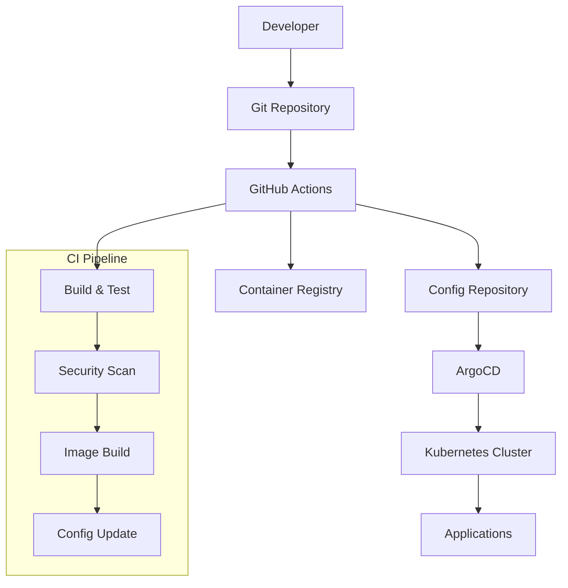
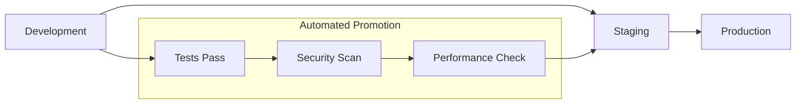

# GitOps CI/CD Pipeline

## Project Overview

Designed and implemented a comprehensive GitOps-based CI/CD pipeline that revolutionized how development teams deploy applications. The solution provides automated testing, security scanning, progressive delivery, and self-healing capabilities while maintaining full audit trails and compliance requirements.

## Key Achievements

- **Deployment Frequency**: Increased from weekly to multiple times per day
- **Lead Time**: Reduced deployment lead time from 2 weeks to 30 minutes
- **Failure Rate**: Decreased deployment failure rate by 85%
- **Recovery Time**: Mean time to recovery reduced to under 10 minutes

## GitOps Architecture

### Core Principles

1. **Declarative Configuration**: All infrastructure and applications defined as code
2. **Version Controlled**: Git as the single source of truth
3. **Automated Synchronization**: Continuous reconciliation of desired vs actual state
4. **Observable**: Comprehensive monitoring and alerting

### Architecture Overview



## CI/CD Pipeline Components

### Continuous Integration (GitHub Actions)

```yaml
# .github/workflows/ci.yml
name: CI Pipeline

on:
  push:
    branches: [main, develop]
  pull_request:
    branches: [main]

jobs:
  test:
    runs-on: ubuntu-latest
    steps:
      - uses: actions/checkout@v3
      
      - name: Setup Node.js
        uses: actions/setup-node@v3
        with:
          node-version: '18'
          cache: 'npm'
          
      - name: Install dependencies
        run: npm ci
        
      - name: Run tests
        run: npm run test:coverage
        
      - name: Upload coverage
        uses: codecov/codecov-action@v3

  security-scan:
    runs-on: ubuntu-latest
    steps:
      - uses: actions/checkout@v3
      
      - name: Run Snyk security scan
        uses: snyk/actions/node@master
        env:
          SNYK_TOKEN: ${{ secrets.SNYK_TOKEN }}
          
      - name: Run SAST scan
        uses: github/codeql-action/analyze@v2

  build-and-push:
    needs: [test, security-scan]
    runs-on: ubuntu-latest
    if: github.ref == 'refs/heads/main'
    
    steps:
      - uses: actions/checkout@v3
      
      - name: Configure AWS credentials
        uses: aws-actions/configure-aws-credentials@v2
        with:
          aws-access-key-id: ${{ secrets.AWS_ACCESS_KEY_ID }}
          aws-secret-access-key: ${{ secrets.AWS_SECRET_ACCESS_KEY }}
          aws-region: us-east-1
          
      - name: Login to ECR
        uses: aws-actions/amazon-ecr-login@v1
        
      - name: Build and push image
        run: |
          docker build -t $ECR_REGISTRY/$ECR_REPOSITORY:$GITHUB_SHA .
          docker push $ECR_REGISTRY/$ECR_REPOSITORY:$GITHUB_SHA
          
      - name: Update deployment config
        run: |
          git clone https://github.com/company/k8s-configs.git
          cd k8s-configs
          yq e '.spec.template.spec.containers[0].image = "$ECR_REGISTRY/$ECR_REPOSITORY:$GITHUB_SHA"' -i apps/myapp/deployment.yaml
          git add .
          git commit -m "Update myapp image to $GITHUB_SHA"
          git push
```

### Continuous Deployment (ArgoCD)

```yaml
# ArgoCD Application Configuration
apiVersion: argoproj.io/v1alpha1
kind: Application
metadata:
  name: myapp
  namespace: argocd
spec:
  project: default
  source:
    repoURL: https://github.com/company/k8s-configs.git
    targetRevision: HEAD
    path: apps/myapp
  destination:
    server: https://kubernetes.default.svc
    namespace: myapp
  syncPolicy:
    automated:
      prune: true
      selfHeal: true
    syncOptions:
      - CreateNamespace=true
    retry:
      limit: 5
      backoff:
        duration: 5s
        factor: 2
        maxDuration: 3m
```

## Progressive Delivery

### Canary Deployments

Implemented Argo Rollouts for progressive delivery:

```yaml
apiVersion: argoproj.io/v1alpha1
kind: Rollout
metadata:
  name: myapp-rollout
spec:
  replicas: 10
  strategy:
    canary:
      steps:
      - setWeight: 10
      - pause: {duration: 2m}
      - setWeight: 25
      - pause: {duration: 5m}
      - setWeight: 50
      - pause: {duration: 10m}
      - setWeight: 75
      - pause: {duration: 10m}
      canaryService: myapp-canary
      stableService: myapp-stable
      trafficRouting:
        istio:
          virtualService:
            name: myapp-vs
            routes:
            - primary
  selector:
    matchLabels:
      app: myapp
  template:
    metadata:
      labels:
        app: myapp
    spec:
      containers:
      - name: myapp
        image: myapp:latest
        ports:
        - containerPort: 8080
```

### Blue-Green Deployments

```yaml
apiVersion: argoproj.io/v1alpha1
kind: Rollout
metadata:
  name: myapp-bluegreen
spec:
  replicas: 5
  strategy:
    blueGreen:
      activeService: myapp-active
      previewService: myapp-preview
      autoPromotionEnabled: false
      scaleDownDelaySeconds: 30
      prePromotionAnalysis:
        templates:
        - templateName: success-rate
        args:
        - name: service-name
          value: myapp-preview
      postPromotionAnalysis:
        templates:
        - templateName: success-rate
        args:
        - name: service-name
          value: myapp-active
```

## Security Integration

### Container Security Scanning

```yaml
# Security scanning in CI pipeline
- name: Container Security Scan
  uses: aquasecurity/trivy-action@master
  with:
    image-ref: '${{ env.ECR_REGISTRY }}/${{ env.ECR_REPOSITORY }}:${{ github.sha }}'
    format: 'sarif'
    output: 'trivy-results.sarif'
    
- name: Upload Trivy scan results
  uses: github/codeql-action/upload-sarif@v2
  with:
    sarif_file: 'trivy-results.sarif'
```

### Policy as Code

Implemented Open Policy Agent (OPA) for governance:

```rego
# security-policies.rego
package kubernetes.admission

deny[msg] {
    input.request.kind.kind == "Pod"
    input.request.object.spec.containers[_].securityContext.runAsRoot == true
    msg := "Containers must not run as root"
}

deny[msg] {
    input.request.kind.kind == "Pod"
    not input.request.object.spec.containers[_].resources.limits.memory
    msg := "Containers must have memory limits"
}

deny[msg] {
    input.request.kind.kind == "Pod"
    not input.request.object.spec.containers[_].resources.limits.cpu
    msg := "Containers must have CPU limits"
}
```

## Monitoring & Observability

### Application Metrics

```yaml
# Prometheus monitoring configuration
apiVersion: monitoring.coreos.com/v1
kind: ServiceMonitor
metadata:
  name: myapp-metrics
spec:
  selector:
    matchLabels:
      app: myapp
  endpoints:
  - port: metrics
    interval: 30s
    path: /metrics
```

### Deployment Analytics

```yaml
# Argo Rollouts AnalysisTemplate
apiVersion: argoproj.io/v1alpha1
kind: AnalysisTemplate
metadata:
  name: success-rate
spec:
  args:
  - name: service-name
  metrics:
  - name: success-rate
    interval: 2m
    count: 5
    successCondition: result[0] >= 0.95
    failureLimit: 3
    provider:
      prometheus:
        address: http://prometheus:9090
        query: |
          sum(rate(http_requests_total{service="{{args.service-name}}",status!~"5.."}[2m])) /
          sum(rate(http_requests_total{service="{{args.service-name}}"}[2m]))
```

## Multi-Environment Strategy

### Environment Promotion



### Environment Configuration

```yaml
# environments/production/kustomization.yaml
apiVersion: kustomize.config.k8s.io/v1beta1
kind: Kustomization

resources:
- ../../base

patchesStrategicMerge:
- deployment-patch.yaml
- service-patch.yaml

replicas:
- name: myapp
  count: 10

images:
- name: myapp
  newTag: v1.2.3
```

## Disaster Recovery & Rollback

### Automated Rollback

```yaml
# Rollback automation
apiVersion: argoproj.io/v1alpha1
kind: Rollout
metadata:
  name: myapp-rollout
spec:
  strategy:
    canary:
      analysis:
        templates:
        - templateName: error-rate
        startingStep: 2
        args:
        - name: service-name
          value: myapp-canary
      steps:
      - setWeight: 10
      - pause: {duration: 2m}
      - analysis:
          templates:
          - templateName: error-rate
          args:
          - name: service-name
            value: myapp-canary
```

### Backup Strategies

```bash
#!/bin/bash
# Automated backup script
kubectl get all -o yaml > backup-$(date +%Y%m%d-%H%M%S).yaml
aws s3 cp backup-*.yaml s3://backup-bucket/k8s-configs/

# Database backup
kubectl exec -n database postgres-0 -- pg_dump -U postgres myapp > db-backup-$(date +%Y%m%d).sql
aws s3 cp db-backup-*.sql s3://backup-bucket/database/
```

## Compliance & Audit

### Audit Logging

```yaml
# Audit policy configuration
apiVersion: audit.k8s.io/v1
kind: Policy
rules:
- level: Metadata
  namespaces: ["production"]
  resources:
  - group: ""
    resources: ["pods", "services"]
  - group: "apps"
    resources: ["deployments", "replicasets"]
```

### Compliance Reporting

```python
# Compliance reporting automation
import boto3
import json
from datetime import datetime

def generate_compliance_report():
    """Generate compliance report for deployments"""
    
    # Collect deployment data
    deployments = get_deployment_history()
    
    report = {
        'timestamp': datetime.utcnow().isoformat(),
        'total_deployments': len(deployments),
        'successful_deployments': len([d for d in deployments if d['status'] == 'success']),
        'failed_deployments': len([d for d in deployments if d['status'] == 'failed']),
        'security_scans_passed': len([d for d in deployments if d['security_scan'] == 'passed']),
        'compliance_violations': get_compliance_violations()
    }
    
    # Upload to S3 for audit trail
    s3 = boto3.client('s3')
    s3.put_object(
        Bucket='compliance-reports',
        Key=f'deployment-report-{datetime.utcnow().strftime("%Y%m%d")}.json',
        Body=json.dumps(report, indent=2)
    )
    
    return report
```

## Performance Optimization

### Build Optimization

```dockerfile
# Multi-stage Dockerfile for optimized builds
FROM node:18-alpine AS builder
WORKDIR /app
COPY package*.json ./
RUN npm ci --only=production

FROM node:18-alpine AS runtime
WORKDIR /app
COPY --from=builder /app/node_modules ./node_modules
COPY . .
EXPOSE 3000
USER node
CMD ["npm", "start"]
```

### Caching Strategies

```yaml
# GitHub Actions caching
- name: Cache Docker layers
  uses: actions/cache@v3
  with:
    path: /tmp/.buildx-cache
    key: ${{ runner.os }}-buildx-${{ github.sha }}
    restore-keys: |
      ${{ runner.os }}-buildx-

- name: Cache node modules
  uses: actions/cache@v3
  with:
    path: ~/.npm
    key: ${{ runner.os }}-node-${{ hashFiles('**/package-lock.json') }}
```

## Results & Impact

### Deployment Metrics

- **Deployment Frequency**: From weekly to 15+ deployments per day
- **Lead Time**: Reduced from 2 weeks to 30 minutes
- **Deployment Success Rate**: Improved from 70% to 98%
- **Mean Time to Recovery**: Reduced from 4 hours to 8 minutes

### Developer Experience

- **Self-Service**: Developers can deploy independently
- **Visibility**: Real-time deployment status and metrics
- **Rollback**: One-click rollback capabilities
- **Testing**: Automated testing in production-like environments

### Security & Compliance

- **Vulnerability Detection**: 100% of deployments scanned for vulnerabilities
- **Policy Compliance**: Automated policy enforcement
- **Audit Trail**: Complete deployment history and approvals
- **Zero-Trust**: No direct cluster access required

## Lessons Learned

### Success Factors

- **GitOps Principles**: Declarative configuration simplified operations
- **Progressive Delivery**: Reduced risk through gradual rollouts
- **Automation**: Comprehensive automation reduced human error
- **Observability**: Rich metrics enabled data-driven decisions

### Challenges Overcome

- **Cultural Change**: Training teams on GitOps workflows
- **Tool Integration**: Seamless integration between CI/CD tools
- **Security**: Balancing security with developer velocity
- **Complexity**: Managing complexity while maintaining simplicity

## Future Enhancements

### Planned Improvements

- **Multi-Cluster Deployments**: Cross-cluster deployment orchestration
- **AI-Powered Rollbacks**: Machine learning for automated rollback decisions
- **Advanced Analytics**: Predictive deployment success analysis
- **Service Mesh Integration**: Enhanced traffic management and security

---

## Technologies Used

- **GitOps**: ArgoCD, Flux
- **CI/CD**: GitHub Actions, Jenkins
- **Container**: Docker, Kubernetes, Helm
- **Security**: Snyk, Trivy, OPA, Falco
- **Monitoring**: Prometheus, Grafana, Jaeger
- **Cloud**: AWS, Azure, GCP

*This project demonstrates expertise in modern DevOps practices, GitOps workflows, and enterprise-scale deployment automation.*