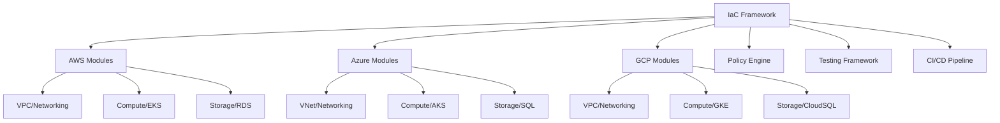

# Infrastructure as Code Framework

## Project Overview

Designed and implemented a comprehensive Infrastructure as Code (IaC) framework that standardizes infrastructure provisioning across multiple cloud providers. The framework includes reusable Terraform modules, automated testing, policy enforcement, and self-service capabilities that reduced infrastructure deployment time by 90% while ensuring consistency and compliance.

## Key Achievements

- **Deployment Speed**: Reduced infrastructure provisioning from weeks to hours
- **Consistency**: 100% standardization across all environments
- **Cost Savings**: 35% reduction in infrastructure costs through optimization
- **Compliance**: Automated policy enforcement with zero compliance violations

## Framework Architecture

### Multi-Cloud Strategy

### Core Components

- **Terraform Modules**: Reusable, tested infrastructure components
- **Policy Engine**: Open Policy Agent (OPA) for governance
- **Testing Frame